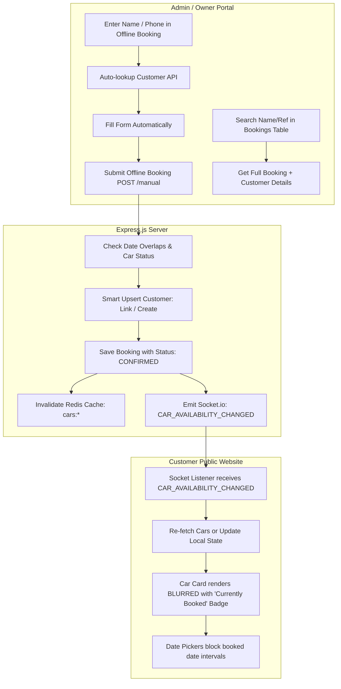

# Modern Booking System: Architecture & Implementation Guide
> **Complete blueprint for:**
> 1. Searching Bookings by Customer Name / Phone / Ref ID with Full Relational Details
> 2. Returning Customer Auto-Lookup & Autofill for New / Offline Bookings
> 3. Admin / Offline Booking Flow with Real-Time Public Car Blurring & Availability Lock

---

## Table of Contents
1. [System Architecture Overview](#1-system-architecture-overview)
2. [Database Models & Indexes (Mongoose / MongoDB)](#2-database-models--indexes-mongoose--mongodb)
3. [Feature 1: Search Bookings by Name & Get Complete Details](#3-feature-1-search-bookings-by-name--get-complete-details)
   - [3.1 Backend Query & Aggregation Service](#31-backend-query--aggregation-service)
   - [3.2 Controller & API Route](#32-controller--api-route)
   - [3.3 Frontend Search & Booking Details Modal / Drawer](#33-frontend-search--booking-details-modal--drawer)
4. [Feature 2: Returning Customer Autofill in New / Offline Booking](#4-feature-2-returning-customer-autofill-in-new--offline-booking)
   - [4.1 Backend Customer Lookup & Search APIs](#41-backend-customer-lookup--search-apis)
   - [4.2 Offline Booking Creation (`createManualBooking`)](#42-offline-booking-creation-createmanualbooking)
   - [4.3 Frontend Customer Search & Auto-Fill Component](#43-frontend-customer-search--auto-fill-component)
5. [Feature 3: Offline Booking to Real-Time Public Car Blurring](#5-feature-3-offline-booking-to-real-time-public-car-blurring)
   - [5.1 Availability Computation Engine (`injectBookingStatus`)](#51-availability-computation-engine-injectbookingstatus)
   - [5.2 WebSocket & Cache Invalidation Pipeline](#52-websocket--cache-invalidation-pipeline)
   - [5.3 Frontend Public Car Card with Blur & Status Overlay](#53-frontend-public-car-card-with-blur--status-overlay)
   - [5.4 Real-Time Socket Listener on Public Pages](#54-real-time-socket-listener-on-public-pages)
6. [Step-by-Step Implementation Roadmap for New Project](#6-step-by-step-implementation-roadmap-for-new-project)
7. [Edge Cases & Production Checklist](#7-edge-cases--production-checklist)

---

## 1. System Architecture Overview



---

## 2. Database Models & Indexes (Mongoose / MongoDB)

### 2.1 Customer Model (`models/Customer.js`)
Stores customer profile, contact details, identity documents (Aadhaar, License), and address.

```javascript
import mongoose from 'mongoose';

const customerSchema = new mongoose.Schema({
  name: {
    type: String,
    required: [true, 'Name is required'],
    trim: true,
    maxlength: 100
  },
  email: {
    type: String,
    required: [true, 'Email is required'],
    unique: true,
    lowercase: true,
    trim: true
  },
  password: {
    type: String,
    select: false
  },
  phone: {
    type: String,
    trim: true,
    index: true // Key for quick lookup
  },
  address: {
    type: String,
    trim: true,
    maxlength: 250
  },
  drivingLicenceNumber: {
    type: String,
    trim: true,
    maxlength: 50
  },
  aadhaarNumber: {
    type: String,
    trim: true,
    maxlength: 30
  },
  documents: {
    aadhaar: {
      front: { url: String, publicId: String },
      back: { url: String, publicId: String },
      verified: { type: Boolean, default: false }
    },
    license: {
      front: { url: String, publicId: String },
      back: { url: String, publicId: String },
      verified: { type: Boolean, default: false }
    }
  },
  isActive: {
    type: Boolean,
    default: true
  }
}, {
  timestamps: true
});

// Indexes for fast searching
customerSchema.index({ phone: 1 });
customerSchema.index({ name: 'text', email: 'text' });
customerSchema.index({ name: 1 });

export default mongoose.model('Customer', customerSchema);
```

### 2.2 Car Model (`models/Car.js`)
Stores vehicle details, daily rental rates, and owner-defined blocked periods (e.g. repairs).

```javascript
import mongoose from 'mongoose';

const unavailableDateSchema = new mongoose.Schema({
  startDate: { type: Date, required: true },
  endDate: { type: Date, required: true },
  reason: { type: String, default: 'Maintenance' }
});

const carSchema = new mongoose.Schema({
  make: { type: String, required: true, trim: true },
  model: { type: String, required: true, trim: true },
  year: { type: Number, required: true },
  category: { type: String, enum: ['Sedan', 'SUV', 'Hatchback', 'Luxury'], required: true },
  fuelType: { type: String, default: 'Petrol' },
  transmission: { type: String, default: 'Manual' },
  registrationNumber: { type: String, trim: true },
  pricePerDay: { type: Number, required: true, min: 0 },
  location: { type: String, default: 'Main Hub' },
  images: [{
    url: String,
    publicId: String
  }],
  owner: {
    type: mongoose.Schema.Types.ObjectId,
    ref: 'Owner',
    required: true
  },
  isActive: { type: Boolean, default: true },
  isDeleted: { type: Boolean, default: false },
  unavailableDates: [unavailableDateSchema],
  totalBookings: { type: Number, default: 0 }
}, {
  timestamps: true
});

// Indexes for search and query filtering
carSchema.index({ isActive: 1, isDeleted: 1 });
carSchema.index({ make: 'text', model: 'text', registrationNumber: 'text' });

export default mongoose.model('Car', carSchema);
```

### 2.3 Booking Model (`models/Booking.js`)
Stores booking dates, references to `Car` and `Customer`, denormalized `phone` for ultra-fast searches, payment details, and KYC documents.

```javascript
import mongoose from 'mongoose';

export const BOOKING_STATUS = {
  PENDING: 'pending',
  CONFIRMED: 'confirmed',
  ACTIVE: 'active',
  COMPLETED: 'completed',
  CANCELLED: 'cancelled'
};

export const PAYMENT_STATUS = {
  PENDING: 'pending',
  PAID: 'paid',
  PARTIAL: 'partial',
  PAY_AT_CAR: 'pay_at_car'
};

const bookingSchema = new mongoose.Schema({
  referenceId: {
    type: String,
    unique: true,
    sparse: true
  },
  car: {
    type: mongoose.Schema.Types.ObjectId,
    ref: 'Car',
    required: true,
    index: true
  },
  owner: {
    type: mongoose.Schema.Types.ObjectId,
    ref: 'Owner',
    required: true,
    index: true
  },
  customer: {
    type: mongoose.Schema.Types.ObjectId,
    ref: 'Customer',
    required: true,
    index: true
  },
  phone: {
    type: String,
    trim: true,
    index: true // Denormalized for rapid query matching
  },
  startDate: {
    type: Date,
    required: true
  },
  endDate: {
    type: Date,
    required: true
  },
  totalPrice: {
    type: Number,
    required: true
  },
  securityDeposit: {
    type: Number,
    default: 0
  },
  amountPaid: {
    type: Number,
    default: 0
  },
  status: {
    type: String,
    enum: Object.values(BOOKING_STATUS),
    default: BOOKING_STATUS.CONFIRMED
  },
  paymentStatus: {
    type: String,
    enum: Object.values(PAYMENT_STATUS),
    default: PAYMENT_STATUS.PAID
  },
  notes: {
    type: String,
    maxlength: 500
  },
  invoiceNumber: {
    type: String,
    sparse: true
  },
  documents: {
    aadhaar: {
      front: { url: String, publicId: String },
      back: { url: String, publicId: String }
    },
    license: {
      front: { url: String, publicId: String },
      back: { url: String, publicId: String }
    }
  },
  cancellationReason: String,
  cancellationNote: String,
  cancelledBy: { type: String, enum: ['customer', 'owner', null], default: null }
}, {
  timestamps: true,
  toJSON: { virtuals: true },
  toObject: { virtuals: true }
});

// Compound Indexes for fast dashboard & availability queries
bookingSchema.index({ car: 1, startDate: 1, endDate: 1 });
bookingSchema.index({ owner: 1, status: 1 });
bookingSchema.index({ owner: 1, phone: 1 });

export default mongoose.model('Booking', bookingSchema);
```

---

## 3. Feature 1: Search Bookings by Name & Get Complete Details

### 3.1 Backend Query & Aggregation Service
When searching by customer name, phone number, car make/model, or booking Reference ID, the backend needs to perform multi-entity matching and populate full details.

Create `services/booking.service.js`:

```javascript
import Booking, { BOOKING_STATUS } from '../models/Booking.js';
import Customer from '../models/Customer.js';
import Car from '../models/Car.js';

/**
 * Escapes regex special characters to prevent regex-injection crashes
 */
const escapeRegex = (str) => str.replace(/[.*+?^${}()|[\]\\]/g, '\\$&');

export const getOwnerBookings = async (ownerId, filters = {}, pagination = { page: 1, limit: 15 }) => {
  const query = { owner: ownerId };

  // 1. Status Filter
  if (filters.status && filters.status !== 'all') {
    query.status = filters.status;
  }

  // 2. Date Range Filter
  if (filters.startDate || filters.endDate) {
    query.startDate = {};
    if (filters.startDate) query.startDate.$gte = new Date(filters.startDate);
    if (filters.endDate) query.startDate.$lte = new Date(filters.endDate);
  }

  // 3. Multi-Field Search (Name, Phone, Car Model, Ref ID)
  const searchQuery = (filters.search || filters.q || '').trim();
  if (searchQuery) {
    const safeSearch = escapeRegex(searchQuery);
    const cleanDigits = searchQuery.replace(/\D/g, '');

    // Step A: Find Customer IDs matching name or email
    const customerConditions = [
      { name: { $regex: safeSearch, $options: 'i' } },
      { email: { $regex: safeSearch, $options: 'i' } }
    ];
    if (cleanDigits.length >= 3) {
      customerConditions.push({ phone: { $regex: cleanDigits, $options: 'i' } });
      if (cleanDigits.length >= 10) {
        customerConditions.push({ phone: { $regex: cleanDigits.slice(-10), $options: 'i' } });
      }
    }
    const matchedCustomerIds = await Customer.find({ $or: customerConditions }).distinct('_id');

    // Step B: Find Car IDs matching Make, Model, or Registration Plate
    const matchedCarIds = await Car.find({
      owner: ownerId,
      $or: [
        { make: { $regex: safeSearch, $options: 'i' } },
        { model: { $regex: safeSearch, $options: 'i' } },
        { registrationNumber: { $regex: safeSearch, $options: 'i' } }
      ]
    }).distinct('_id');

    // Step C: Build Compound $or Query on Booking collection
    const orConditions = [
      { referenceId: { $regex: safeSearch, $options: 'i' } }
    ];
    if (matchedCustomerIds.length > 0) {
      orConditions.push({ customer: { $in: matchedCustomerIds } });
    }
    if (matchedCarIds.length > 0) {
      orConditions.push({ car: { $in: matchedCarIds } });
    }
    if (cleanDigits.length >= 3) {
      orConditions.push({ phone: { $regex: cleanDigits, $options: 'i' } });
      if (cleanDigits.length >= 10) {
        orConditions.push({ phone: { $regex: cleanDigits.slice(-10), $options: 'i' } });
      }
    }

    query.$or = orConditions;
  }

  const skip = (pagination.page - 1) * pagination.limit;
  const total = await Booking.countDocuments(query);

  // 4. Populate complete relational details for Customer and Car
  const bookings = await Booking.find(query)
    .populate('car', 'make model images registrationNumber pricePerDay category fuelType transmission')
    .populate('customer', 'name email phone address drivingLicenceNumber aadhaarNumber documents')
    .skip(skip)
    .limit(pagination.limit)
    .sort({ createdAt: -1 });

  return {
    bookings,
    pagination: {
      page: pagination.page,
      limit: pagination.limit,
      total,
      pages: Math.ceil(total / pagination.limit)
    }
  };
};

/**
 * Fetch a single booking by ID with full vehicle and customer details
 */
export const getBookingById = async (bookingId, ownerId) => {
  const booking = await Booking.findOne({ _id: bookingId, owner: ownerId })
    .populate('car', 'make model images registrationNumber pricePerDay category fuelType transmission year location')
    .populate('customer', 'name email phone address drivingLicenceNumber aadhaarNumber documents createdAt');

  if (!booking) {
    const error = new Error('Booking not found');
    error.statusCode = 404;
    throw error;
  }
  return booking;
};
```

### 3.2 Controller & API Route
In `controllers/booking.controller.js`:

```javascript
import { getOwnerBookings, getBookingById } from '../services/booking.service.js';

export const listOwnerBookings = async (req, res, next) => {
  try {
    const pagination = {
      page: parseInt(req.query.page) || 1,
      limit: parseInt(req.query.limit) || 15
    };
    const result = await getOwnerBookings(req.owner._id, req.query, pagination);
    return res.status(200).json({
      success: true,
      message: 'Bookings retrieved successfully',
      data: result.bookings,
      pagination: result.pagination
    });
  } catch (err) {
    next(err);
  }
};

export const getBookingDetails = async (req, res, next) => {
  try {
    const booking = await getBookingById(req.params.id, req.owner._id);
    return res.status(200).json({
      success: true,
      data: booking
    });
  } catch (err) {
    next(err);
  }
};
```

Routes in `routes/owner.booking.routes.js`:
```javascript
import { Router } from 'express';
import { listOwnerBookings, getBookingDetails } from '../controllers/booking.controller.js';
import { authMiddleware } from '../middleware/auth.js';

const router = Router();
router.use(authMiddleware);

router.get('/', listOwnerBookings);
router.get('/:id', getBookingDetails);

export default router;
```

---

### 3.3 Frontend Search & Booking Details Modal / Drawer
A production-ready React component with search debouncing, reactive table, and a slide-over modal rendering complete booking, customer, KYC, and vehicle data:

```jsx
import React, { useState, useEffect } from 'react';
import axios from 'axios';

export default function BookingsManagement() {
  const [bookings, setBookings] = useState([]);
  const [loading, setLoading] = useState(false);
  const [searchQuery, setSearchQuery] = useState('');
  const [statusFilter, setStatusFilter] = useState('all');
  const [selectedBooking, setSelectedBooking] = useState(null);

  // 1. Debounce search query to prevent excessive backend calls
  useEffect(() => {
    const timer = setTimeout(() => {
      fetchBookings(searchQuery.trim());
    }, 300);
    return () => clearTimeout(timer);
  }, [searchQuery, statusFilter]);

  const fetchBookings = async (search) => {
    setLoading(true);
    try {
      const res = await axios.get('/api/owner/bookings', {
        params: { search, status: statusFilter }
      });
      setBookings(res.data.data || []);
    } catch (err) {
      console.error('Failed to load bookings:', err);
    } finally {
      setLoading(false);
    }
  };

  return (
    <div className="p-6 max-w-7xl mx-auto">
      {/* Header & Search Bar */}
      <div className="flex flex-col md:flex-row justify-between items-center gap-4 mb-6">
        <div>
          <h1 className="text-2xl font-bold text-gray-900">Bookings Directory</h1>
          <p className="text-sm text-gray-500">Search by customer name, mobile number, or car</p>
        </div>
        <div className="flex items-center gap-3 w-full md:w-auto">
          <input
            type="text"
            placeholder="🔍 Search name, phone, car, Ref ID..."
            value={searchQuery}
            onChange={(e) => setSearchQuery(e.target.value)}
            className="w-full md:w-80 px-4 py-2.5 border border-gray-300 rounded-lg text-sm focus:outline-none focus:ring-2 focus:ring-blue-500"
          />
          <select
            value={statusFilter}
            onChange={(e) => setStatusFilter(e.target.value)}
            className="px-3 py-2.5 border border-gray-300 rounded-lg text-sm bg-white"
          >
            <option value="all">All Statuses</option>
            <option value="confirmed">Confirmed</option>
            <option value="active">Active</option>
            <option value="completed">Completed</option>
            <option value="cancelled">Cancelled</option>
          </select>
        </div>
      </div>

      {/* Bookings Table */}
      <div className="bg-white border rounded-xl shadow-sm overflow-hidden">
        <table className="min-w-full divide-y divide-gray-200 text-left text-sm">
          <thead className="bg-gray-50 text-gray-600 font-semibold uppercase text-xs">
            <tr>
              <th className="px-6 py-3.5">Ref / Date</th>
              <th className="px-6 py-3.5">Customer Name & Phone</th>
              <th className="px-6 py-3.5">Vehicle</th>
              <th className="px-6 py-3.5">Duration</th>
              <th className="px-6 py-3.5">Payment</th>
              <th className="px-6 py-3.5">Status</th>
              <th className="px-6 py-3.5 text-right">Action</th>
            </tr>
          </thead>
          <tbody className="divide-y divide-gray-100">
            {loading ? (
              <tr><td colSpan="7" className="text-center py-10 text-gray-400">Loading bookings...</td></tr>
            ) : bookings.length === 0 ? (
              <tr><td colSpan="7" className="text-center py-10 text-gray-400">No bookings found</td></tr>
            ) : (
              bookings.map((b) => (
                <tr key={b._id} className="hover:bg-gray-50/80 transition-colors">
                  <td className="px-6 py-4 font-mono font-medium text-blue-600">
                    {b.referenceId || b._id.slice(-6).toUpperCase()}
                    <div className="text-xs text-gray-400">{new Date(b.createdAt).toLocaleDateString()}</div>
                  </td>
                  <td className="px-6 py-4">
                    <div className="font-semibold text-gray-900">{b.customer?.name || 'Walk-in Customer'}</div>
                    <div className="text-xs text-gray-500">📞 {b.phone || b.customer?.phone || 'N/A'}</div>
                  </td>
                  <td className="px-6 py-4 font-medium text-gray-800">
                    {b.car?.make} {b.car?.model}
                    <span className="block text-xs text-gray-400">{b.car?.registrationNumber}</span>
                  </td>
                  <td className="px-6 py-4 text-xs text-gray-600">
                    {new Date(b.startDate).toLocaleDateString()} &rarr; {new Date(b.endDate).toLocaleDateString()}
                  </td>
                  <td className="px-6 py-4">
                    <span className="font-semibold text-gray-900">₹{b.totalPrice}</span>
                    <span className={`block text-[11px] font-medium ${b.paymentStatus === 'paid' ? 'text-green-600' : 'text-amber-600'}`}>
                      {b.paymentStatus.toUpperCase()}
                    </span>
                  </td>
                  <td className="px-6 py-4">
                    <span className={`px-2.5 py-1 rounded-full text-xs font-semibold ${
                      b.status === 'confirmed' ? 'bg-green-100 text-green-700' :
                      b.status === 'active' ? 'bg-blue-100 text-blue-700' :
                      b.status === 'cancelled' ? 'bg-red-100 text-red-700' : 'bg-gray-100 text-gray-700'
                    }`}>
                      {b.status}
                    </span>
                  </td>
                  <td className="px-6 py-4 text-right">
                    <button
                      onClick={() => setSelectedBooking(b)}
                      className="px-3 py-1.5 bg-gray-900 hover:bg-black text-white text-xs font-semibold rounded-md transition"
                    >
                      View Details
                    </button>
                  </td>
                </tr>
              ))
            )}
          </tbody>
        </table>
      </div>

      {/* Slide-Over Details Modal */}
      {selectedBooking && (
        <div className="fixed inset-0 z-50 bg-black/40 backdrop-blur-sm flex justify-end">
          <div className="bg-white w-full max-w-xl h-full shadow-2xl p-6 overflow-y-auto">
            <div className="flex justify-between items-center border-b pb-4 mb-5">
              <div>
                <span className="text-xs font-bold uppercase tracking-wider text-blue-600">Booking Summary</span>
                <h2 className="text-xl font-bold text-gray-900">{selectedBooking.referenceId || selectedBooking._id}</h2>
              </div>
              <button onClick={() => setSelectedBooking(null)} className="text-gray-400 hover:text-gray-700 text-2xl font-bold">&times;</button>
            </div>

            {/* Customer Details Section */}
            <div className="bg-gray-50 border rounded-xl p-4 mb-4">
              <h3 className="text-xs font-bold text-gray-500 uppercase mb-2">Customer Profile</h3>
              <p className="text-base font-bold text-gray-900">{selectedBooking.customer?.name}</p>
              <div className="grid grid-cols-2 gap-2 text-xs text-gray-600 mt-2">
                <div>📞 <strong>Phone:</strong> {selectedBooking.phone || selectedBooking.customer?.phone}</div>
                <div>✉️ <strong>Email:</strong> {selectedBooking.customer?.email}</div>
                <div>🪪 <strong>Aadhaar:</strong> {selectedBooking.customer?.aadhaarNumber || 'Not provided'}</div>
                <div>🚘 <strong>License:</strong> {selectedBooking.customer?.drivingLicenceNumber || 'Not provided'}</div>
                <div className="col-span-2">📍 <strong>Address:</strong> {selectedBooking.customer?.address || 'Not provided'}</div>
              </div>
            </div>

            {/* Vehicle Details */}
            <div className="bg-gray-50 border rounded-xl p-4 mb-4">
              <h3 className="text-xs font-bold text-gray-500 uppercase mb-2">Vehicle Details</h3>
              <div className="flex items-center gap-3">
                {selectedBooking.car?.images?.[0]?.url && (
                  
                )}
                <div>
                  <p className="font-bold text-gray-900">{selectedBooking.car?.make} {selectedBooking.car?.model}</p>
                  <p className="text-xs text-gray-500">{selectedBooking.car?.registrationNumber} • {selectedBooking.car?.fuelType}</p>
                </div>
              </div>
            </div>

            {/* Dates & Financials */}
            <div className="border rounded-xl p-4 mb-4 space-y-2 text-sm">
              <div className="flex justify-between">
                <span className="text-gray-500">Trip Dates:</span>
                <span className="font-semibold text-gray-800">
                  {new Date(selectedBooking.startDate).toLocaleString()} &rarr; {new Date(selectedBooking.endDate).toLocaleString()}
                </span>
              </div>
              <div className="flex justify-between border-t pt-2">
                <span className="text-gray-500">Total Rental Cost:</span>
                <span className="font-bold text-gray-900">₹{selectedBooking.totalPrice}</span>
              </div>
              <div className="flex justify-between">
                <span className="text-gray-500">Advance Paid:</span>
                <span className="font-semibold text-green-600">₹{selectedBooking.amountPaid || 0}</span>
              </div>
              <div className="flex justify-between">
                <span className="text-gray-500">Security Deposit:</span>
                <span className="font-semibold text-amber-700">₹{selectedBooking.securityDeposit || 0}</span>
              </div>
            </div>

            {/* Uploaded KYC Documents Preview */}
            <div className="mb-6">
              <h3 className="text-xs font-bold text-gray-500 uppercase mb-2">Identity & Verification Documents</h3>
              <div className="grid grid-cols-2 gap-3">
                {selectedBooking.documents?.aadhaar?.front?.url && (
                  <div>
                    <span className="text-[11px] font-semibold text-gray-600">Aadhaar (Front)</span>
                    <a href={selectedBooking.documents.aadhaar.front.url} target="_blank" rel="noreferrer">
                      
                    </a>
                  </div>
                )}
                {selectedBooking.documents?.license?.front?.url && (
                  <div>
                    <span className="text-[11px] font-semibold text-gray-600">Driver License</span>
                    <a href={selectedBooking.documents.license.front.url} target="_blank" rel="noreferrer">
                      
                    </a>
                  </div>
                )}
              </div>
            </div>

            <button
              onClick={() => setSelectedBooking(null)}
              className="w-full py-2.5 bg-gray-100 hover:bg-gray-200 text-gray-800 font-semibold rounded-lg text-sm"
            >
              Close Drawer
            </button>
          </div>
        </div>
      )}
    </div>
  );
}
```

---

## 4. Feature 2: Returning Customer Autofill in New / Offline Booking

When registering a walk-in customer in the admin panel:
1. Entering **Phone Number** (10 digits) automatically queries the backend and fills name, address, DL, Aadhaar.
2. Typing a **Name** in a customer search bar displays autocomplete suggestions with their previous booking count.
3. Clicking **Autofill** populates all fields immediately.

### 4.1 Backend Customer Lookup & Search APIs
Add the following functions to `controllers/booking.controller.js`:

```javascript
import Customer from '../models/Customer.js';
import Booking from '../models/Booking.js';

/**
 * Fast lookup by 10-digit phone number
 */
export const lookupCustomerByPhone = async (req, res, next) => {
  try {
    const { phone } = req.query;
    if (!phone) {
      return res.json({ success: true, data: { found: false, customer: null } });
    }

    const cleanDigits = phone.replace(/\D/g, '');
    const last10 = cleanDigits.length >= 10 ? cleanDigits.slice(-10) : cleanDigits;

    if (last10.length < 10) {
      return res.json({ success: true, data: { found: false, customer: null } });
    }

    // 1. Search in Customer collection
    let customer = await Customer.findOne({
      $or: [
        { phone: last10 },
        { phone: `+91${last10}` },
        { phone: { $regex: last10, $options: 'i' } }
      ]
    }).select('-password').lean();

    // 2. Fallback: Search past bookings if customer wasn't registered
    if (!customer) {
      const pastBooking = await Booking.findOne({
        owner: req.owner._id,
        $or: [
          { phone: last10 },
          { phone: `+91${last10}` }
        ]
      }).sort({ createdAt: -1 }).populate('customer', '-password').lean();

      if (pastBooking?.customer) {
        customer = pastBooking.customer;
      }
    }

    if (!customer) {
      return res.json({ success: true, data: { found: false, customer: null } });
    }

    // 3. Count past bookings for loyalty verification
    const pastBookingsCount = await Booking.countDocuments({
      owner: req.owner._id,
      $or: [{ customer: customer._id }, { phone: last10 }]
    });

    const lastBooking = await Booking.findOne({
      owner: req.owner._id,
      $or: [{ customer: customer._id }, { phone: last10 }]
    }).sort({ createdAt: -1 }).select('startDate createdAt').lean();

    return res.json({
      success: true,
      data: {
        found: true,
        customer,
        pastBookingsCount,
        lastBookingDate: lastBooking?.startDate || lastBooking?.createdAt || null
      }
    });
  } catch (err) {
    next(err);
  }
};

/**
 * Search customers by Name, Driving License, Email, or Phone
 */
export const searchCustomer = async (req, res, next) => {
  try {
    const { q } = req.query;
    if (!q || !q.trim()) {
      return res.json({ success: true, data: [] });
    }

    const cleanQ = q.trim();
    const safeQ = cleanQ.replace(/[.*+?^${}()|[\]\\]/g, '\\$&');

    const conditions = [
      { name: { $regex: safeQ, $options: 'i' } },
      { email: { $regex: safeQ, $options: 'i' } },
      { drivingLicenceNumber: { $regex: safeQ, $options: 'i' } },
      { aadhaarNumber: { $regex: safeQ, $options: 'i' } }
    ];

    const digits = cleanQ.replace(/\D/g, '');
    if (digits.length >= 3) {
      conditions.push({ phone: { $regex: digits, $options: 'i' } });
      if (digits.length >= 10) {
        conditions.push({ phone: { $regex: digits.slice(-10), $options: 'i' } });
      }
    }

    // Query matched customers
    const customers = await Customer.find({ $or: conditions })
      .select('-password')
      .sort({ updatedAt: -1 })
      .limit(20)
      .lean();

    // Deduplicate by normalized 10-digit phone
    const map = new Map();
    for (const cust of customers) {
      const cleanPhone = cust.phone ? cust.phone.replace(/\D/g, '').slice(-10) : cust._id.toString();
      if (!map.has(cleanPhone)) {
        map.set(cleanPhone, cust);
      }
    }

    const deduplicated = Array.from(map.values()).slice(0, 10);

    // Batch enrich with past bookings count
    const customerIds = deduplicated.map(c => c._id);
    const stats = await Booking.aggregate([
      { $match: { customer: { $in: customerIds } } },
      { $group: { _id: '$customer', count: { $sum: 1 }, lastBookingDate: { $max: '$startDate' } } }
    ]);

    const statsMap = new Map(stats.map(s => [s._id.toString(), s]));
    for (const cust of deduplicated) {
      const stat = statsMap.get(cust._id.toString());
      cust.pastBookingsCount = stat?.count || 0;
      cust.lastBookingDate = stat?.lastBookingDate || null;
    }

    return res.json({ success: true, data: deduplicated });
  } catch (err) {
    next(err);
  }
};
```

---

### 4.2 Offline Booking Creation (`createManualBooking`)
When the admin submits the offline booking, the server:
1. Validates vehicle availability.
2. Checks if the customer exists by phone/email. If not, it creates a new customer record (generating a placeholder email if missing).
3. Saves the booking.
4. **Invalidates public Redis cache** and **emits a WebSocket event** to blur the car on the public site immediately.

```javascript
import Car from '../models/Car.js';
import Customer from '../models/Customer.js';
import Booking, { BOOKING_STATUS, PAYMENT_STATUS } from '../models/Booking.js';
import { checkAvailability } from './booking.service.js';
import { getIO } from '../config/socket.js';
import redisClient from '../config/redis.js';

export const createManualBooking = async (ownerId, customerData, bookingData) => {
  const { carId, startDate, endDate, totalPrice, securityDeposit, amountPaid, notes, documents } = bookingData;

  // 1. Verify Car Availability (throws 400 if overlapping booking exists)
  await checkAvailability(carId, startDate, endDate);

  const car = await Car.findOne({ _id: carId, owner: ownerId });
  if (!car) {
    throw new Error('Car not found');
  }

  // 2. Identify or Create Customer
  const cleanPhone = customerData.phone ? customerData.phone.replace(/\D/g, '').slice(-10) : '';
  let customer;

  if (cleanPhone) {
    customer = await Customer.findOne({
      $or: [{ phone: cleanPhone }, { phone: `+91${cleanPhone}` }]
    });
  }

  if (!customer && customerData.email) {
    customer = await Customer.findOne({ email: customerData.email });
  }

  if (!customer) {
    // Generate placeholder email for walk-ins without email
    const placeholderEmail = customerData.email || `walkin_${cleanPhone || Date.now()}@domain.local`;
    customer = await Customer.create({
      name: customerData.name,
      email: placeholderEmail,
      phone: cleanPhone,
      address: customerData.address,
      drivingLicenceNumber: customerData.drivingLicenceNumber,
      aadhaarNumber: customerData.aadhaarNumber,
      password: 'TemporaryPassword@123'
    });
  } else {
    // Update existing customer if newer details were entered
    let updated = false;
    if (customerData.address && customer.address !== customerData.address) { customer.address = customerData.address; updated = true; }
    if (customerData.drivingLicenceNumber) { customer.drivingLicenceNumber = customerData.drivingLicenceNumber; updated = true; }
    if (customerData.aadhaarNumber) { customer.aadhaarNumber = customerData.aadhaarNumber; updated = true; }
    if (updated) await customer.save();
  }

  // 3. Create Confirmed Booking
  const refId = `BK-${Date.now().toString().slice(-6)}`;
  const booking = await Booking.create({
    referenceId: refId,
    car: carId,
    owner: ownerId,
    customer: customer._id,
    phone: cleanPhone,
    startDate: new Date(startDate),
    endDate: new Date(endDate),
    totalPrice: totalPrice || car.pricePerDay,
    securityDeposit: securityDeposit || 0,
    amountPaid: amountPaid || 0,
    status: BOOKING_STATUS.CONFIRMED,
    paymentStatus: PAYMENT_STATUS.PAID,
    notes: notes || 'Offline Walk-in Booking',
    documents: documents || {}
  });

  // Increment total bookings counter on Car
  await Car.findByIdAndUpdate(carId, { $inc: { totalBookings: 1 } });

  // 4. Invalidate Cache & Emit Real-Time Socket Event
  try {
    if (redisClient) {
      await redisClient.del('cars:*'); // Flush public car list caches
    }
    const io = getIO();
    if (io) {
      io.to('public').emit('CAR_AVAILABILITY_CHANGED', { carId });
    }
  } catch (err) {
    console.error('Socket or cache error:', err);
  }

  return booking;
};
```

---

### 4.3 Frontend Customer Search & Auto-Fill Component
In `apps/portal/src/pages/AddBooking.jsx`:

```jsx
import React, { useState, useRef } from 'react';
import axios from 'axios';

export default function AddOfflineBooking() {
  const [formData, setFormData] = useState({
    customer: {
      name: '',
      phone: '',
      email: '',
      address: '',
      drivingLicenceNumber: '',
      aadhaarNumber: ''
    },
    booking: {
      carId: '',
      startDate: '',
      endDate: '',
      securityDeposit: 500,
      amountPaid: 0,
      notes: ''
    }
  });

  const [customerSearchQuery, setCustomerSearchQuery] = useState('');
  const [searchResults, setSearchResults] = useState([]);
  const [isSearching, setIsSearching] = useState(false);
  const [showDropdown, setShowDropdown] = useState(false);
  const [returningCustomer, setReturningCustomer] = useState(null);
  const searchTimeoutRef = useRef(null);

  // Trigger 1: Auto-search as admin types name / phone in the search box
  const handleCustomerSearch = (val) => {
    setCustomerSearchQuery(val);
    if (searchTimeoutRef.current) clearTimeout(searchTimeoutRef.current);

    const query = val.trim();
    if (query.length >= 2) {
      setIsSearching(true);
      setShowDropdown(true);

      searchTimeoutRef.current = setTimeout(async () => {
        try {
          const res = await axios.get('/api/owner/bookings/search-customer', { params: { q: query } });
          setSearchResults(res.data.data || []);
        } catch (err) {
          setSearchResults([]);
        } finally {
          setIsSearching(false);
        }
      }, 250);
    } else {
      setSearchResults([]);
      setShowDropdown(false);
    }
  };

  // Trigger 2: Auto-lookup when entering a 10-digit mobile number in the phone field
  const handlePhoneChange = async (e) => {
    const rawDigits = e.target.value.replace(/\D/g, '').slice(0, 10);
    setFormData(prev => ({
      ...prev,
      customer: { ...prev.customer, phone: rawDigits }
    }));

    if (rawDigits.length === 10) {
      try {
        const res = await axios.get('/api/owner/bookings/customer-by-phone', { params: { phone: rawDigits } });
        if (res.data.data?.found && res.data.data.customer) {
          const cust = res.data.data.customer;
          setFormData(prev => ({
            ...prev,
            customer: {
              name: cust.name || prev.customer.name,
              phone: rawDigits,
              email: cust.email?.includes('@domain.local') ? '' : cust.email,
              address: cust.address || '',
              drivingLicenceNumber: cust.drivingLicenceNumber || '',
              aadhaarNumber: cust.aadhaarNumber || ''
            }
          }));
          setReturningCustomer({
            name: cust.name,
            count: res.data.data.pastBookingsCount
          });
        }
      } catch (err) {
        console.error('Phone lookup failed:', err);
      }
    }
  };

  // Selection handler from search dropdown
  const handleSelectCustomer = (cust) => {
    setFormData(prev => ({
      ...prev,
      customer: {
        name: cust.name || '',
        phone: cust.phone ? cust.phone.replace(/\D/g, '').slice(-10) : '',
        email: cust.email?.includes('@domain.local') ? '' : (cust.email || ''),
        address: cust.address || '',
        drivingLicenceNumber: cust.drivingLicenceNumber || '',
        aadhaarNumber: cust.aadhaarNumber || ''
      }
    }));
    setReturningCustomer({
      name: cust.name,
      count: cust.pastBookingsCount || 1
    });
    setShowDropdown(false);
    setCustomerSearchQuery('');
  };

  return (
    <div className="max-w-4xl mx-auto p-8 bg-white border rounded-2xl shadow-sm">
      <h2 className="text-2xl font-bold text-gray-900 mb-2">New Offline / Walk-in Booking</h2>
      <p className="text-sm text-gray-500 mb-6">Create manual offline bookings with instant returning customer autofill.</p>

      {/* Customer Quick Search Dropdown */}
      <div className="relative mb-6 border-b pb-6">
        <label className="block text-xs font-bold uppercase tracking-wider text-gray-700 mb-2">
          Search Existing Customer (Name, Phone, or License)
        </label>
        <input
          type="text"
          placeholder="Type to search returning clients..."
          value={customerSearchQuery}
          onChange={(e) => handleCustomerSearch(e.target.value)}
          className="w-full px-4 py-3 border border-gray-300 rounded-xl text-sm focus:ring-2 focus:ring-blue-500 focus:outline-none"
        />

        {showDropdown && (
          <div className="absolute top-full left-0 right-0 z-20 bg-white border rounded-xl shadow-xl mt-1 max-h-64 overflow-y-auto divide-y">
            {isSearching ? (
              <div className="p-4 text-center text-sm text-gray-400">Searching database...</div>
            ) : searchResults.length === 0 ? (
              <div className="p-4 text-center text-sm text-gray-400">No matching customer found</div>
            ) : (
              searchResults.map(cust => (
                <div
                  key={cust._id}
                  onClick={() => handleSelectCustomer(cust)}
                  className="p-3 hover:bg-blue-50 cursor-pointer flex justify-between items-center transition"
                >
                  <div>
                    <span className="font-bold text-gray-900">{cust.name}</span>
                    <span className="ml-2 text-xs text-gray-500">📞 {cust.phone}</span>
                    <div className="text-xs text-gray-400">{cust.address || 'No address'}</div>
                  </div>
                  <span className="text-xs bg-blue-100 text-blue-800 font-semibold px-2.5 py-1 rounded-full">
                    {cust.pastBookingsCount || 0} Past Bookings &bull; Autofill
                  </span>
                </div>
              ))
            )}
          </div>
        )}
      </div>

      {/* Returning Customer Alert Badge */}
      {returningCustomer && (
        <div className="mb-6 p-4 bg-emerald-50 border border-emerald-200 rounded-xl flex items-center justify-between text-emerald-900">
          <div>
            <p className="font-bold text-sm">✅ Verified Returning Customer: {returningCustomer.name}</p>
            <p className="text-xs text-emerald-700">Completed {returningCustomer.count} past bookings. Details auto-populated!</p>
          </div>
          <button
            type="button"
            onClick={() => {
              setReturningCustomer(null);
              setFormData(p => ({ ...p, customer: { name: '', phone: '', email: '', address: '', drivingLicenceNumber: '', aadhaarNumber: '' } }));
            }}
            className="text-xs font-semibold px-3 py-1.5 bg-white border border-emerald-300 rounded-lg hover:bg-emerald-100"
          >
            Clear / New Client
          </button>
        </div>
      )}

      {/* Booking Form */}
      <form onSubmit={(e) => { e.preventDefault(); /* Call createManualBooking API */ }}>
        <div className="grid grid-cols-1 md:grid-cols-2 gap-4 mb-6">
          <div>
            <label className="block text-xs font-bold text-gray-700 mb-1">Mobile Number (10 Digits) *</label>
            <input
              type="tel"
              required
              maxLength={10}
              value={formData.customer.phone}
              onChange={handlePhoneChange}
              placeholder="e.g. 9876543210"
              className="w-full px-4 py-2.5 border rounded-lg text-sm focus:outline-none focus:ring-2 focus:ring-blue-500"
            />
          </div>
          <div>
            <label className="block text-xs font-bold text-gray-700 mb-1">Customer Full Name *</label>
            <input
              type="text"
              required
              value={formData.customer.name}
              onChange={(e) => setFormData(p => ({ ...p, customer: { ...p.customer, name: e.target.value } }))}
              className="w-full px-4 py-2.5 border rounded-lg text-sm focus:outline-none focus:ring-2 focus:ring-blue-500"
            />
          </div>
          <div>
            <label className="block text-xs font-bold text-gray-700 mb-1">Driving License Number</label>
            <input
              type="text"
              value={formData.customer.drivingLicenceNumber}
              onChange={(e) => setFormData(p => ({ ...p, customer: { ...p.customer, drivingLicenceNumber: e.target.value } }))}
              className="w-full px-4 py-2.5 border rounded-lg text-sm"
            />
          </div>
          <div>
            <label className="block text-xs font-bold text-gray-700 mb-1">Aadhaar Card Number</label>
            <input
              type="text"
              value={formData.customer.aadhaarNumber}
              onChange={(e) => setFormData(p => ({ ...p, customer: { ...p.customer, aadhaarNumber: e.target.value } }))}
              className="w-full px-4 py-2.5 border rounded-lg text-sm"
            />
          </div>
          <div className="md:col-span-2">
            <label className="block text-xs font-bold text-gray-700 mb-1">Residential Address</label>
            <input
              type="text"
              value={formData.customer.address}
              onChange={(e) => setFormData(p => ({ ...p, customer: { ...p.customer, address: e.target.value } }))}
              className="w-full px-4 py-2.5 border rounded-lg text-sm"
            />
          </div>
        </div>

        <button
          type="submit"
          className="w-full py-3 bg-blue-600 hover:bg-blue-700 text-white font-bold rounded-xl text-sm transition"
        >
          Confirm & Create Offline Booking
        </button>
      </form>
    </div>
  );
}
```

---

## 5. Feature 3: Offline Booking to Real-Time Public Car Blurring

### 5.1 Availability Computation Engine (`injectBookingStatus`)
Create `utils/carUtils.js`. This function dynamically evaluates every car against active bookings and blocked dates, injecting `isBooked`, `bookedUntil`, and `nextAvailableDate`:

```javascript
import Booking, { BOOKING_STATUS } from '../models/Booking.js';

export const injectBookingStatus = async (cars, dateRange = {}) => {
  if (!cars || cars.length === 0) return cars;

  const now = new Date();
  const carIds = cars.map(c => c._id);

  const targetStart = dateRange.startDate ? new Date(dateRange.startDate) : null;
  const targetEnd = dateRange.endDate ? new Date(dateRange.endDate) : null;
  const hasTargetRange = targetStart && targetEnd && !isNaN(targetStart.getTime()) && !isNaN(targetEnd.getTime());

  // 10-minute hold threshold for pending checkouts
  const tenMinutesAgo = new Date(Date.now() - 10 * 60 * 1000);

  // Fetch all active or confirmed bookings overlapping now or future
  const query = {
    car: { $in: carIds },
    $or: [
      { status: { $in: [BOOKING_STATUS.CONFIRMED, BOOKING_STATUS.ACTIVE] } },
      { status: BOOKING_STATUS.PENDING, createdAt: { $gte: tenMinutesAgo } }
    ],
    endDate: { $gte: now }
  };

  const relevantBookings = await Booking.find(query).sort({ startDate: 1 }).lean();

  const carBookingsMap = {};
  for (const b of relevantBookings) {
    const cId = b.car.toString();
    if (!carBookingsMap[cId]) carBookingsMap[cId] = [];
    carBookingsMap[cId].push(b);
  }

  return cars.map(car => {
    const plainCar = car.toObject ? car.toObject() : { ...car };
    const cId = plainCar._id.toString();
    const bookings = carBookingsMap[cId] || [];

    // Map owner manual blocks
    const unavailableBlocks = (plainCar.unavailableDates || []).map(u => ({
      startDate: new Date(u.startDate),
      endDate: new Date(u.endDate),
      source: 'blocked'
    }));

    // Map booked ranges
    const bookingRanges = bookings.map(b => ({
      startDate: new Date(b.startDate),
      endDate: new Date(b.endDate),
      source: 'booking'
    }));

    const allRanges = [...bookingRanges, ...unavailableBlocks].sort((a, b) => a.startDate - b.startDate);

    // Is the car on an active trip RIGHT NOW?
    const currentActive = allRanges.find(r => r.startDate <= now && r.endDate >= now);

    // Does the car conflict with user-selected start/end dates?
    let conflictsWithTarget = false;
    if (hasTargetRange) {
      conflictsWithTarget = allRanges.some(r => r.startDate < targetEnd && r.endDate > targetStart);
    }

    const isBooked = hasTargetRange ? (conflictsWithTarget || !!currentActive) : !!currentActive;

    // Calculate when the car becomes available
    let nextAvailableDate = new Date(now);
    if (currentActive) {
      let candidate = new Date(currentActive.endDate);
      for (const r of allRanges) {
        if (r.startDate <= candidate && r.endDate >= candidate) {
          candidate = new Date(r.endDate);
        }
      }
      nextAvailableDate = candidate;
    }

    return {
      ...plainCar,
      isBooked,
      bookedUntil: currentActive ? currentActive.endDate : null,
      nextAvailableDate: isBooked ? nextAvailableDate : null,
      bookedRanges: allRanges
    };
  });
};
```

---

### 5.2 WebSocket & Cache Invalidation Pipeline
Setup Socket.io in your backend:

`config/socket.js`:
```javascript
import { Server } from 'socket.io';

let io;

export const initSocket = (httpServer) => {
  io = new Server(httpServer, {
    cors: { origin: '*', methods: ['GET', 'POST'] }
  });

  io.on('connection', (socket) => {
    // Public clients join the 'public' broadcast room
    socket.join('public');
  });

  return io;
};

export const getIO = () => io;
```

In `services/car.service.js`:
```javascript
import Car from '../models/Car.js';
import { injectBookingStatus } from '../utils/carUtils.js';

export const getPublicCars = async (filters = {}) => {
  const cars = await Car.find({ isActive: true, isDeleted: false });
  // Dynamic status injection
  return await injectBookingStatus(cars, filters);
};
```

---

### 5.3 Frontend Public Car Card with Blur & Status Overlay
In `apps/public/src/components/CarCard.jsx`:

```jsx
import React from 'react';
import { Link } from 'react-router-dom';

export default function CarCard({ car }) {
  const isBooked = car?.isBooked;

  const formatDate = (dateStr) => {
    if (!dateStr) return '';
    return new Date(dateStr).toLocaleDateString('en-IN', { month: 'short', day: 'numeric' });
  };

  return (
    <div className={`rounded-2xl overflow-hidden border border-gray-200 bg-white flex flex-col transition-all duration-300 ${
      isBooked ? 'opacity-90 shadow-none' : 'shadow-md hover:shadow-xl'
    }`}>
      {/* Image Container with Blur Filter */}
      <div className="relative h-56 w-full overflow-hidden bg-gray-100">
        

        {/* OVERLAY BADGE WHEN BOOKED */}
        {isBooked && (
          <div className="absolute inset-0 bg-black/40 backdrop-blur-[2px] flex flex-col items-center justify-center p-4 text-center">
            <div className="px-3 py-1.5 rounded-full bg-gray-950 text-white font-bold text-xs tracking-wider uppercase shadow-lg flex items-center gap-2 border border-white/20">
              <span className="w-2 h-2 rounded-full bg-amber-400 animate-pulse" />
              Currently Booked
            </div>
            {car.nextAvailableDate && (
              <span className="mt-2 text-xs font-semibold text-white bg-black/60 px-3 py-1 rounded-md backdrop-blur-md">
                Available from {formatDate(car.nextAvailableDate)}
              </span>
            )}
          </div>
        )}
      </div>

      {/* Vehicle Info */}
      <div className="p-5 flex-1 flex flex-col justify-between">
        <div>
          <h3 className="text-lg font-bold text-gray-900">{car.make} {car.model}</h3>
          <p className="text-xs font-semibold text-gray-500 mt-1">{car.category} &bull; {car.fuelType} &bull; {car.year}</p>

          {isBooked && car.nextAvailableDate && (
            <div className="mt-3 p-2 bg-amber-50 border border-amber-200 rounded-lg text-xs font-bold text-amber-900 flex items-center gap-2">
              <span>⏳ Next Slot:</span>
              <span>{formatDate(car.nextAvailableDate)}</span>
            </div>
          )}
        </div>

        {/* Pricing & Call-to-Action */}
        <div className="mt-5 pt-4 border-t flex items-center justify-between">
          <div>
            <span className="text-xl font-extrabold text-gray-900">₹{car.pricePerDay}</span>
            <span className="text-xs text-gray-500"> / day</span>
          </div>

          <Link
            to={`/cars/${car._id}`}
            className={`px-5 py-2.5 rounded-xl text-xs font-bold uppercase tracking-wider transition ${
              isBooked
                ? 'bg-gray-200 text-gray-700 hover:bg-gray-300'
                : 'bg-black text-white hover:bg-gray-800 shadow-md'
            }`}
          >
            {isBooked ? 'View Dates' : 'Book Now'}
          </Link>
        </div>
      </div>
    </div>
  );
}
```

---

### 5.4 Real-Time Socket Listener on Public Pages
In `apps/public/src/pages/Fleet.jsx` or `CarDetail.jsx`:

```jsx
import React, { useState, useEffect, useCallback } from 'react';
import axios from 'axios';
import { io } from 'socket.io-client';
import CarCard from '../components/CarCard';

export default function FleetPage() {
  const [cars, setCars] = useState([]);

  const fetchCars = useCallback(async () => {
    try {
      const res = await axios.get('/api/cars');
      setCars(res.data.data || []);
    } catch (err) {
      console.error(err);
    }
  }, []);

  useEffect(() => {
    fetchCars();

    // Connect to WebSockets
    const socket = io(window.location.origin);
    
    // Listen for availability changes from offline or online bookings
    socket.on('CAR_AVAILABILITY_CHANGED', () => {
      fetchCars(); // Automatically updates UI to blur booked vehicle in real time!
    });

    return () => {
      socket.disconnect();
    };
  }, [fetchCars]);

  return (
    <div className="grid grid-cols-1 md:grid-cols-3 gap-6 p-6">
      {cars.map(car => (
        <CarCard key={car._id} car={car} />
      ))}
    </div>
  );
}
```

---

## 6. Step-by-Step Implementation Roadmap for New Project

1. **Setup Mongoose Models**:
   - Create `Customer.js`, `Car.js`, and `Booking.js`. Add indexes on `phone`, `owner`, `car`, and `dates`.
2. **Implement Availability Helper**:
   - Add `utils/carUtils.js` (`injectBookingStatus`). This attaches `isBooked: true` and `nextAvailableDate` to vehicle objects.
3. **Build Customer Lookup & Search APIs**:
   - Add `lookupCustomerByPhone` and `searchCustomer` in your booking controller.
4. **Build Offline Booking Controller**:
   - Implement `createManualBooking`. Ensure it runs `checkAvailability`, links/upserts the customer, invalidates cache, and emits `CAR_AVAILABILITY_CHANGED`.
5. **Implement Admin Portal UI**:
   - Add the customer search box with debounce and the 10-digit phone number auto-trigger.
   - Add the booking directory table with debounced name/phone search and the full details slide-over drawer.
6. **Implement Public Web UI**:
   - Add CSS blur (`blur-[3px] grayscale`) and overlay badges when `car.isBooked` is true.
   - Add the Socket.io client listener (`socket.on('CAR_AVAILABILITY_CHANGED')`) to re-fetch or flip availability instantly without full page refresh.

---

## 7. Edge Cases & Production Checklist

- [x] **Regex Sanitization**: Special regex characters (`+`, `*`, `?`, `^`, `$`, `(`, `)`) in search queries must always be escaped using `replace(/[.*+?^${}()|[\]\\]/g, '\\$&')` to prevent server crashes.
- [x] **Phone Digit Normalization**: Strip country codes (`+91`) and non-numeric characters using `replace(/\D/g, '')` and match against the last 10 digits to support various user input formats (`+91 98765-43210` vs `9876543210`).
- [x] **Concurrency Locking**: When multiple admins or users attempt to book the same vehicle at the same second, wrap booking creation in a Redis distributed lock (`booking:car:${carId}`) with a 15-second TTL.
- [x] **Timezone Invariance**: Ensure date overlap comparisons compare UTC midnight timestamps (`setUTCHours(0,0,0,0)`) to prevent cross-timezone booking collisions.
- [x] **Placeholder Accounts for Walk-ins**: Walk-in clients often do not provide email addresses. Automatically generate placeholder emails (`walkin_[phone]_[id]@domain.local`) with randomized passwords to maintain relational integrity.
