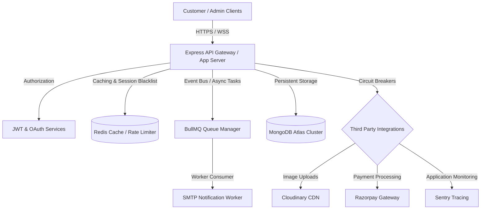

# 🚗 Modern Selfdrive (Car Rental Platform)

An enterprise-grade, high-performance, full-stack car rental platform engineered for modern web scale. This project features a triple-app architecture: a high-speed customer-facing application, a feature-rich owner/staff administration portal, and a resilient, secure REST API backend built to enterprise standards.

[](#)
[](#)
[](#)
[](#)
[](#)

---

## 🏛️ System Architecture

The platform is designed around a decoupled, monorepo structure separating client interfaces from the high-throughput server.

```
modern-selfdrive/
├── apps/
│   ├── public/              # Customer Web App (React 19, Vite, Tailwind CSS)
│   └── portal/              # Owner/Staff Admin Portal (React 19, Vite, Tailwind CSS, Recharts)
├── server/                  # Core REST API & WebSockets (Express, Node.js, Mongoose, Socket.IO)
│   ├── src/
│   │   ├── config/          # Subsystem configurations (Redis, Opossum, Sentry, Mongoose)
│   │   ├── controllers/     # API request handlers
│   │   ├── middleware/      # Rate limits, security headers, tracing, auth verification
│   │   ├── models/          # MongoDB schemas
│   │   ├── routes/          # Express routing tree
│   │   ├── services/        # Business logic & integrations (Cloudinary, Razorpay, BullMQ)
│   │   └── utils/           # Shared utilities (logger, error classes, tracer)
│   ├── scripts/             # Operational scripts (migrations, DB checks, pass reset)
│   └── tests/               # Integration & unit test suites (Jest)
├── package.json             # Root workspace script definitions
└── render.yaml              # Production cloud infrastructure definition
```

### Deployment Topology



---

## 🚀 Key Features & Capabilities

### Core Features
- **Fleet & Availability Engine**: Live car tracking, status toggling, automatic date blocking, and administrative pricing rules.
- **Booking Lifecycle**: Seamless rental checkout with date selection, owner approvals, and user cancels.
- **Real-Time Synchronization**: Bidirectional Socket.IO links syncing booking notifications, status updates, and fleet metrics instantly.
- **Analytics Engine**: Real-time revenue, booking counts, active cars, and status distribution visualized with Recharts.

### 🛡️ Production & Security Hardening
- **JWT & Session Revocation**: Dual token strategy (short-lived Access Tokens, long-lived Refresh Tokens) with sliding-window Redis revocation blacklist checking.
- **Role-Based Access Control (RBAC)**: Fine-grained middleware authorization ensuring `User`, `Staff`, and `Owner` endpoints are rigidly isolated.
- **Secure File Ingestion**: Multler-based upload middleware validating MIME-types, file signatures, and constraining sizes, ensuring upload parsers do not leak system handles.
- **Rate-Limiting Shields**: Hybrid distributed rate-limiting powered by Redis and `express-rate-limit` protecting authentication, upload, and payment routes from brute-force/DDoS attempts.
- **Helmet Security Headers**: Fully configured Content Security Policy (CSP), HSTS, frame options, and referrer policies.

### ⚡ Reliability & Performance
- **Idempotency Safeguards**: High-volume mutation endpoints (bookings, payments) require a unique `x-idempotency-key` header to prevent double-charging and race conditions, enforced via Redis.
- **Resilience Circuit Breakers**: `Opossum` circuit breakers wrapping external APIs (Cloudinary, Razorpay) to prevent cascade failures. When third-party services degrade, the system falls back gracefully.
- **BullMQ Task Queues**: Asynchronous mailers and background updates are processed via a Redis-backed queue system with automatic retry backoffs and dead-letter queue (DLQ) fallback.
- **Traced Correlation**: Correlation IDs (`x-correlation-id`) automatically generated or propagated across logs and API calls to enable clean distributed debugging.
- **Deep Observability**: Prometheus scraping path `/metrics` exposing API response rates, active connection counts, DB health indicators, and circuit breaker metrics.

---

## 🛠️ Technology Stack

| Component | Technology | Rationale |
|:---|:---|:---|
| **Frontend Runtime** | React 19, Vite | Fast, standard compilation with highly optimized HMR |
| **Frontend Styling** | Tailwind CSS | Utility-first, responsive grid management without bloating production bundles |
| **Backend Runtime** | Node.js (ESM), Express | Light footprint, robust middleware ecosystem, and non-blocking I/O |
| **Database** | MongoDB + Mongoose | Flexible schema structures for rental specifications and booking metrics |
| **Caching & Queues** | Redis + BullMQ | Fast key-value operations for session blacklists, rate limits, and job queues |
| **Payment Gateway** | Razorpay SDK | Fully integrated checkout flow with dynamic payment webhook reconciliation |
| **Storage CDN** | Cloudinary SDK | Cloud-based media storage with dynamic optimization and resizing |
| **Unit & Integration Tests** | Jest + Supertest | Clean test assertions running against MongoDB memory instances |

---

## ⚙️ Setup & Installation

### Prerequisites
- Node.js `20.x` or higher
- Redis Server (local or hosted, e.g., Upstash)
- MongoDB (local instance or MongoDB Atlas Cluster)

### 1. Clone & Install Dependencies
Clone the repository and install packages across all projects:
```bash
git clone https://github.com/Jeeerryyy/Car-Rental-Modern-.git
cd Car-Rental-Modern-
npm run install:all
```

### 2. Environment Variables Configuration
Copy the configuration files and customize their properties:
```bash
# Core API
cp server/.env.example server/.env

# Public Client
cp apps/public/.env.example apps/public/.env

# Admin Portal
cp apps/portal/.env.example apps/portal/.env
```

Review and update the variables within each `.env` file (refer to the [Environment Variables](#-environment-variables) section below).

### 3. Database Seeding
Populate the database with initial administrative accounts, sample vehicles, and base rules:
```bash
cd server
npm run seed
cd ..
```

### 4. Running the Development Server
Launch the API, public website, and admin portal simultaneously using the root development script:
```bash
npm run dev
```

This script spins up:
- **Core API Backend**: `http://localhost:5000`
- **Customer Web Interface**: `http://localhost:5173`
- **Owner Admin Portal**: `http://localhost:5174`

---

## 🔑 Environment Variables Reference

### Backend API Variables (`server/.env`)

| Variable | Required | Description |
|:---|:---:|:---|
| `NODE_ENV` | Yes | App runtime stage (`development`, `production`, `test`) |
| `PORT` | Yes | Server binding port (defaults to `5000`) |
| `MONGO_URI` | Yes | MongoDB connection string |
| `REDIS_URL` | Yes | Redis cluster connection URI |
| `JWT_SECRET` | Yes | Owner/Staff JWT encryption signature (min. 32 chars) |
| `CUSTOMER_JWT_SECRET` | Yes | Customer JWT encryption signature (min. 32 chars) |
| `JWT_EXPIRY` | Yes | Access token lifetime duration (e.g., `15m`, `1h`) |
| `CLIENT_URL` | Yes | Public web app domain origin for CORS validation |
| `PORTAL_URL` | Yes | Admin portal domain origin for CORS validation |
| `CLOUDINARY_CLOUD_NAME` | Yes | Cloudinary Cloud Identifier |
| `CLOUDINARY_API_KEY` | Yes | Cloudinary API Key |
| `CLOUDINARY_API_SECRET` | Yes | Cloudinary API Secret |
| `PAYMENT_ENABLED` | No | Toggle payment requirements (`true` or `false`) |
| `RAZORPAY_KEY_ID` | Conditional | Razorpay API key (required if payment enabled) |
| `RAZORPAY_SECRET` | Conditional | Razorpay API secret key (required if payment enabled) |
| `RAZORPAY_WEBHOOK_SECRET` | Conditional | Webhook verification signature (required if payment enabled) |
| `SMTP_HOST` | No | SMTP outgoing mail server address |
| `SMTP_PORT` | No | SMTP network port (e.g., `587` or `465`) |
| `SMTP_USER` | No | SMTP authentication username |
| `SMTP_PASS` | No | SMTP authentication password/token |
| `GOOGLE_CLIENT_ID` | Yes | Google OAuth Client ID for customer SSO |
| `GOOGLE_CLIENT_SECRET` | Yes | Google OAuth Client Secret |

### Frontend Variables (`apps/public/.env` and `apps/portal/.env`)

| Variable | Required | Description |
|:---|:---:|:---|
| `VITE_API_URL` | Yes | Endpoint base URL for AJAX requests |
| `VITE_SOCKET_URL` | Yes | Socket server endpoint domain |
| `VITE_GOOGLE_CLIENT_ID` | Yes | Client ID for Google SSO integration |
| `VITE_APP_NAME` | Yes | Display application header brand string |

---

## 🧪 Testing Suite

The backend features an integration test suite powered by Jest. The tests isolate database interactions using `mongodb-memory-server` and mock external assets.

Run the test runner inside the server directory:
```bash
cd server
npm run test
```

Generate coverage reports:
```bash
npm run test:coverage
```

All 54 tests must pass cleanly. Any refactoring to core models, routes, or auth schemas must be verified against this suite to prevent regressions.

---

## 🚀 Production Deployment

### 1. Deploying the Backend API (Render)
1. Set up a **Web Service** on Render.
2. Link your repository.
3. Configure the settings:
   - **Root Directory**: `server`
   - **Build Command**: `npm install`
   - **Start Command**: `node src/server.js`
4. Set all required environment variables in the Render console (derived from `server/.env.example`).
5. Copy the deployed web service URL to update the frontends' environment configs.

### 2. Deploying the Frontend Applications (Vercel)
1. Add new projects on Vercel from the repository.
2. For the **Customer App**:
   - **Root Directory**: `apps/public`
   - **Framework Preset**: Vite
   - Set environment variables (`VITE_API_URL`, `VITE_SOCKET_URL`, `VITE_GOOGLE_CLIENT_ID`, `VITE_APP_NAME`).
3. For the **Admin Portal**:
   - **Root Directory**: `apps/portal`
   - **Framework Preset**: Vite
   - Set environment variables (`VITE_API_URL`, `VITE_SOCKET_URL`, `VITE_APP_NAME`).

---

## 🔒 Security Hardening Checklists

Before promoting to public or production builds, verify:
- [ ] No `.env` files are tracked in git history (enforced via `.gitignore`).
- [ ] All production secrets (`JWT_SECRET`, API keys) are generated with cryptographically strong entropy (minimum 256 bits).
- [ ] `PAYMENT_ENABLED` is switched to `true` only after verified webhook routes and valid SSL configs are active.
- [ ] Redis instance is password-protected and configured over TLS.
- [ ] Sentry logs have scrubbed payment values, password hashes, and customer phone numbers.

---

## 📝 License & Credits

- **Copyright**: © 2017–2026 Modern Selfdrive Car Rentals, Junagadh.
- **Engineering & Architecture**: Developed with a focus on web performance, service isolation, and high-availability operations.